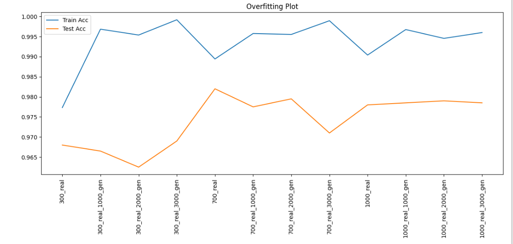

# Reduced MNIST GAN Augmentation

This repository explores how augmenting small subsets of MNIST with GAN-generated samples affects a simple CNN classifier’s performance.

## Overview

We study augmentation of **reduced MNIST** subsets (300, 700, or 1000 real samples per digit) with **GAN-generated** digits (in batches of 1,000, 2,000, or 3,000 per digit) and measure how it impacts:

- **Train vs. held-out test accuracy** of a small CNN (2 conv layers + pooling + 128-unit dense layer).
- Overfitting and diminishing returns when adding synthetic data.

## Experimental Setup

- **Real dataset:** MNIST subset with exactly 300, 700, or 1000 real images per digit.  
- **Synthetic augmentation:** GAN-generated digits in batches of 1000, 2000, or 3000 per digit.  
- **Classifier:**  
  - 2× convolutional layers + pooling  
  - 128-unit fully connected layer  
  - Trained for 5 epochs per real/synthetic scenario  
- **Metrics:** Train accuracy vs. held-out test accuracy.

## Synthetic Sample Visualization


*Figure 1. Five GAN-generated examples of digit “3.”*

## Results Summary

| Real \ Synthetic | 0 gen | 1000 gen | 2000 gen | 3000 gen |
|------------------|-------|----------|----------|----------|
| **300 real**     | 96.80 | 96.65    | 96.25    | 96.90    |
| **700 real**     | 98.20 | 97.75    | 97.95    | 97.10    |
| **1000 real**    | 97.80 | 97.85    | 97.90    | 97.85    |

*Table 1. Test accuracy (%) by real vs. synthetic counts.*



*Figure 2. Training and test accuracy across all scenarios.*

## Analysis & Comments

1. **Over-fitting with synthetic data**  
   Synthetic samples drive train accuracy to nearly 100% but test
   accuracy sees only marginal gains or slight dips, indicating memorization of the generated GAN images rather than better generalization.
2. **Diminishing returns**  
   Beyond 700 real samples, extra GAN data offers negligible benefit. E.g., 700 real + 2000 gen (97.95%) slightly outperforms 1000 real alone (97.80%), but 1000 real + any gen shows no further gains.

3. **Optimal mix varies**  
   - For **300 real**, adding 3000 synthetic gives the best boost (96.90%).  
   - For **700 real**, pure-real still wins; any mix underperforms.  
   - For **1000 real**, synthetic adds no value.

## Recommendations

- **Filter synthetic outputs** by quality (e.g., discard blurred/misaligned digits).  
- **Enhance GAN**: deeper architectures or more training epochs may yield more useful augmentations.  
- **Tune real:synthetic ratio** more finely (e.g., 1:1 or 1:2) on a validation split to find the sweet spot.

## Usage

1. **Clone**  

   ```bash
   git clone [https://github.com/Omarkhaled711/deep-learning-projects.git](https://github.com/Omarkhaled711/deep-learning-projects.git); cd deep-learning-projects;
   cd reduced-mnist-gan-augmentation
   ```

2. **Install dependencies**  

   ```bash
   pip install -r requirements.txt
   ```
